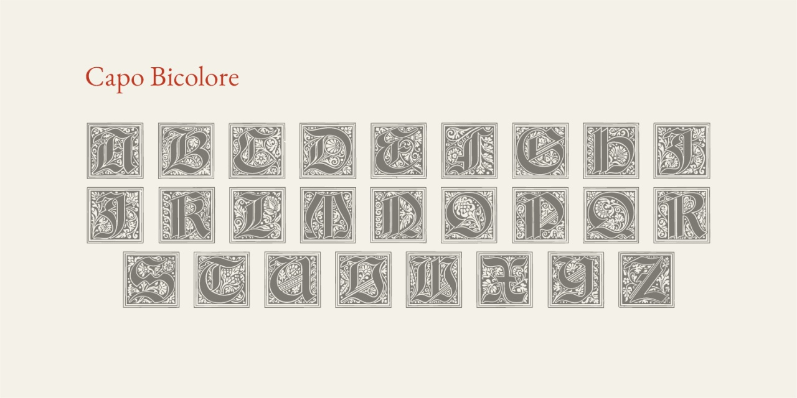

# Capo Bicolore
* Versione 1.500: fix dimensioni
* Versione 1.101: fix esportazione
* Versione 1.0: versione iniziale

Per testare il font, vedere la [pagina interattiva](https://m-casanova.github.io/CapoBicolore/).

## Descrizione

Il font "Capo Bicolore" è basato su capolettera gotici (_Gotische Initialen_) <a target="_blank" href="https://archive.org/details/schriftenatlasei00petz/page/n159/mode/2up">pubblicati da Ludwig Petzendorfer nel 1894</a>.
Questo capolettera è stato già inserito nel carattere [In die busillis](https://github.com/m-casanova/In-die-busillis).

È possibile utilizzare il carattere come semplice capolettera monocromatico. Sono presenti solo i caratteri da A a Z.

È anche possibile rendere ogni capolettera in due colori. Lo sfondo è selezionato tramite stile __ss01__ mentre il carattere effettivo è dato dallo stile __ss02__. In entrambi i casi si utilizza il carattere maiuscolo.

